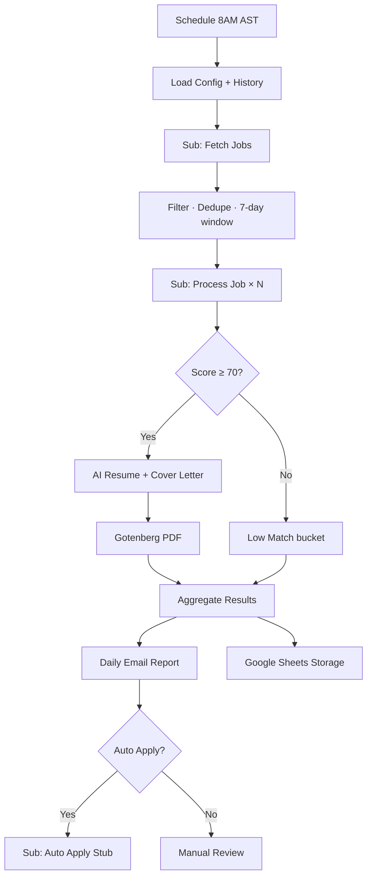

# JobPilot AI — n8n Automation (Saudi Arabia + Remote)

Production-ready, modular n8n workflows for daily job discovery, AI match scoring, tailored resume/cover letter generation, and email reporting.

## Architecture



## Workflows

| File | Purpose |
|------|---------|
| `workflows/main-daily-job-agent.json` | Main orchestrator — schedule, email, storage |
| `workflows/sub-fetch-jobs.json` | Fetches from Adzuna, Greenhouse, Lever, Ashby, RSS |
| `workflows/sub-process-job.json` | AI scoring, resume/cover letter, PDF export |
| `workflows/sub-auto-apply-stub.json` | Future auto-apply integration point |

Import order: **sub-workflows first**, then the main workflow.

## Quick Start

### 1. Prerequisites

- [n8n](https://n8n.io/) (self-hosted or cloud)
- OpenAI API key
- Google account (Sheets + Gmail)
- [Gotenberg](https://gotenberg.dev/) for HTML → PDF (Docker: `docker run -p 3000:3000 gotenberg/gotenberg:8`)
- [Adzuna API keys](https://developer.adzuna.com/) (free tier for Saudi listings)

### 2. Google Sheets setup

Create a spreadsheet with a sheet named **`ProcessedJobs`** and these columns (row 1):

```
id | company | title | location | matchScore | source | applyUrl | datePosted | processedAt | applicationStatus | resumeVersion | tier
```

Copy the spreadsheet ID into `GOOGLE_SHEETS_JOBS_SPREADSHEET_ID`.

### 3. Environment variables

Copy `.env.example` and set in n8n (**Settings → Variables**):

| Variable | Required | Description |
|----------|----------|-------------|
| `OPENAI_API_KEY` | Yes | AI scoring & document generation |
| `NOTIFICATION_EMAIL` | Yes | Daily report recipient |
| `ADZUNA_APP_ID` / `ADZUNA_APP_KEY` | Yes | Saudi job search |
| `GOOGLE_SHEETS_JOBS_SPREADSHEET_ID` | Yes | Job storage & dedup |
| `MASTER_RESUME_TEXT` | Yes | Full master resume text |
| `GOTENBERG_URL` | Yes | PDF service URL |
| `MIN_MATCH_SCORE` | No | Default `70` |
| `JOB_MAX_AGE_DAYS` | No | Default `7` |
| `AUTO_APPLY_ENABLED` | No | Default `false` |
| `AI_MODEL` | No | Default `gpt-4o-mini` |

### 4. Import workflows

1. Open n8n → **Workflows → Import from File**
2. Import in this order:
   - `sub-fetch-jobs.json`
   - `sub-process-job.json`
   - `sub-auto-apply-stub.json`
   - `main-daily-job-agent.json`
3. Connect credentials on nodes marked `REPLACE_WITH_CREDENTIAL_ID`:
   - OpenAI
   - Google Sheets OAuth2
   - Gmail OAuth2
4. Activate **main workflow** (sub-workflows stay inactive — called via Execute Workflow)

### 5. Test manually

1. Open **JobPilot — Daily Job Agent**
2. Click **Execute Workflow**
3. Check Gmail for the daily report
4. Verify new rows in Google Sheets

## Job Sources

Configured in `config/sources.json` and embedded in the **Load Config** node.

| Source | Status | Notes |
|--------|--------|-------|
| **Adzuna** | Active | Saudi Arabia (`/jobs/sa/`) |
| **Greenhouse** | Active | Public board API |
| **Lever** | Active | Public postings API |
| **Ashby** | Active | Public job board API |
| **RSS** | Active | RemoteOK, We Work Remotely |
| **Saudi career portals** | Configurable | NEOM via Greenhouse; SABIC/Aramco need custom parsers |
| **Government (Qiwa/Jadarat)** | Disabled | Enable only with official API access |
| **LinkedIn** | Disabled | Official API only — do not scrape |

To add a Greenhouse board, append to `greenhouse.boards` in config. Same pattern for Lever companies and Ashby boards.

## Pipeline Rules

### Match scoring (0–100)

- Compares job description against **master resume only**
- Never invents skills or experience
- Dimensions: title alignment, skills overlap, experience relevance, domain fit, location fit

### Thresholds

| Score | Action |
|-------|--------|
| **< 70** | Save as `low_match` — no resume generated |
| **≥ 70** | Generate ATS resume + cover letter → PDF |
| **≥ 70 + Auto Apply** | Route to auto-apply stub (implement per ATS) |

### Filters

- **Region:** Saudi cities (Riyadh, Jeddah, Dammam, Khobar, Dhahran, Makkah, Madinah, NEOM, Tabuk) + worldwide Remote
- **Work type:** Remote, Hybrid, On-site (all enabled by default)
- **Age:** Posted within last 7 days
- **Titles:** Software Engineer, AI Engineer, ML Engineer, Backend, Full Stack, Mobile, iOS, Python, LLM, Prompt Engineer, etc.

### Deduplication

Jobs are keyed by `company + title + location + applyUrl`. Already-processed IDs are loaded from Google Sheets before scoring.

## Scheduling

- **Cron:** `0 8 * * *`
- **Timezone:** `Asia/Riyadh` (8:00 AM Saudi time)
- Set in workflow **Settings → Timezone**

## Daily Email

One email per run, sorted by match score (highest first). Each job includes:

- Company, title, location, match score
- Apply link
- Match summary
- Resume PDF + cover letter PDF attachments (qualified jobs)

## Auto Apply (Future)

Set `AUTO_APPLY_ENABLED=true` when ready. The stub sub-workflow receives qualified jobs and logs an apply plan. Implement per-source adapters:

1. **Greenhouse** — form POST to apply URL
2. **Lever** — Lever application endpoint
3. **Ashby** — Ashby apply API

Never auto-apply without explicit user consent and CAPTCHA handling.

## Shared Libraries

| File | Purpose |
|------|---------|
| `lib/pipeline.js` | Normalize, dedupe, filter, sort |
| `lib/prompts.js` | AI prompt templates |
| `lib/templates.js` | HTML email/resume templates |

These mirror the logic embedded in n8n Code nodes. Edit the Code nodes or sync from these files when updating logic.

## JobPilot Frontend Integration

The Next.js app in this repo uses placeholder webhooks in `src/lib/webhooks.ts`. Connect them to n8n webhooks:

| Frontend action | Suggested n8n webhook |
|-----------------|----------------------|
| Start automation | `POST /webhook/automation/start` → Manual Trigger on main workflow |
| Save settings | `POST /webhook/automation/settings` → Update Google Sheets Settings tab |
| Upload resume | `POST /webhook/onboarding/resume` → Update `MASTER_RESUME_TEXT` or Drive file |

## Troubleshooting

| Issue | Fix |
|-------|-----|
| No Adzuna results | Verify `ADZUNA_APP_ID` and `ADZUNA_APP_KEY` |
| PDF generation fails | Ensure Gotenberg is running at `GOTENBERG_URL` |
| Duplicate jobs | Check `ProcessedJobs` sheet has `id` column populated |
| OpenAI JSON parse errors | Lower temperature; verify `AI_MODEL` supports JSON mode |
| Sub-workflow not found | Import sub-workflows first; names must match exactly |

## Compliance

- Use **official/public APIs** only for LinkedIn and government portals
- Respect each platform's Terms of Service
- Store personal data securely (resume, application history)
- Auto-apply requires explicit user opt-in
